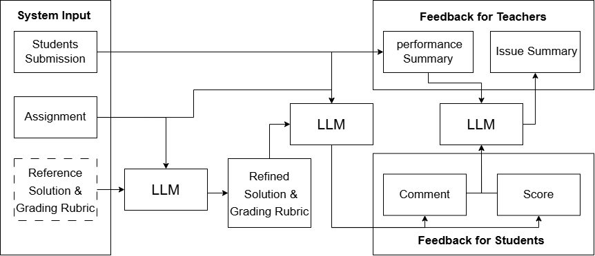

# 📝 A Zero-Shot LLM Framework for Automatic Assignment Grading in Higher Education

This repository contains the code and resources for the paper titled **"A Zero-Shot LLM Framework for Automatic Assignment Grading in Higher Education."** It includes the survey results and the code used for analysis in the paper.

<p align="center">
  
</p>

## 📊 Result Replication

### 1. Clone the Repository
Begin by cloning the repository to your local machine:
```bash
git clone <repository_url>
```
### 2. Navigate to the Project Directory
Change to the project directory:
```bash
cd ./AAG
```
### 3. Install Required Packages
Install the necessary dependencies by running the following command:
```bash
pip install -r requirements.txt
```
### 4. Run the Correlation Calculation (Result of Section 4.1)
Execute the code to calculate the correlation:
```bash
python correlation.py
```
### 5. Run the Statistical Tests (Result of Section 4.2)
Execute the code to perform the statistical tests:
```bash
python stats_test.py
```
