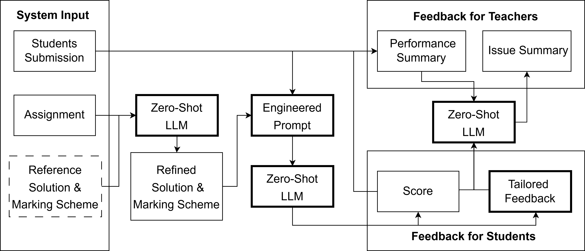

# 📝 A Zero-Shot LLM Framework for Automatic Assignment Grading in Higher Education

This repository contains the code and resources for the paper titled **"A Zero-Shot LLM Framework for Automatic Assignment Grading in Higher Education."** It includes the survey results and the code used for analysis in the paper.

<p align="center">
  
</p>

Automated grading has become an essential tool in education technology due to its ability to efficiently assess large volumes of student work, provide consistent and unbiased evaluations, and deliver immediate feedback to enhance learning. However, current systems face significant limitations, including the need for large datasets in few-shot learning methods, a lack of personalized and actionable feedback, and an overemphasis on benchmark performance rather than student experience. To address these challenges, we propose a Zero-Shot Large Language Model (LLM)-Based Automated Assignment Grading (AAG) system. This framework leverages prompt engineering to evaluate both computational and explanatory student responses without requiring additional training or fine-tuning. The AAG system delivers tailored feedback that highlights individual strengths and areas for improvement, thereby enhancing student learning outcomes. Our study demonstrates the system's effectiveness through comprehensive evaluations, including survey responses from higher education students that indicate significant improvements in motivation, understanding, and preparedness compared to traditional grading methods. The results validate the AAG system's potential to transform educational assessment by prioritizing learning experiences and providing scalable, high-quality feedback.

## 📊 Result Replication

### 1. Clone the Repository
Begin by cloning the repository to your local machine:
```bash
git clone <repository_url>
```
### 2. Navigate to the Project Directory
Change to the project directory:
```bash
cd ./AAG
```
### 3. Install Required Packages
Install the necessary dependencies by running the following command:
```bash
pip install -r requirements.txt
```
### 4. Run the Correlation Calculation (Result of Section 4.1)
Execute the code to calculate the correlation:
```bash
python correlation.py
```
### 5. Run the Statistical Tests (Result of Section 4.2)
Execute the code to perform the statistical tests:
```bash
python stats_test.py
```
